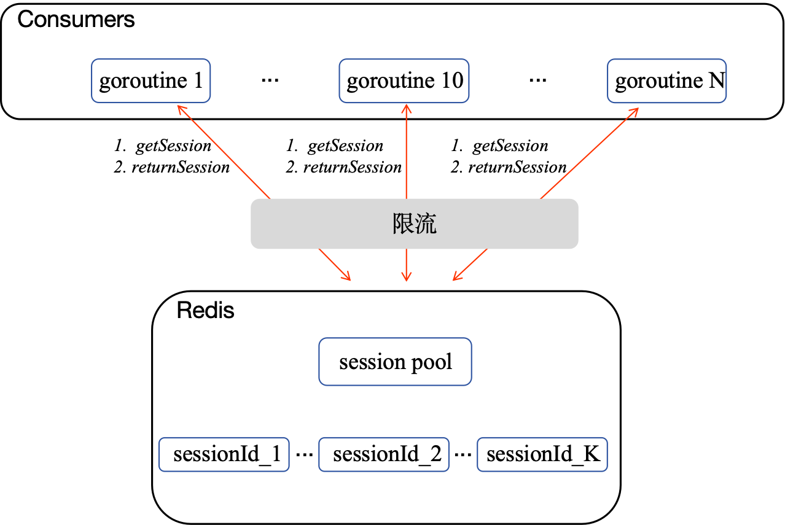

# sessionPool
用go实现一个存放在redis的sessionPool，并且用goroutine模拟消费者消费session。
## 需求分析
1. 消费者需要按FIFO有序使用session pool中的session，使用完放回pool的尾部。
2. 每个session都有最大使用次数和过期时间，超过了将session作废。
3. 当程序panic退出时，需要有机制保证session信息不会丢失。
4. 要实现对消费者的限流。
## 代码目录
```
sessionPool
├── README.md
└── src
    ├── consumer.go 消费者代码
    └── sessionPool.go 创建sessionPool代码
```
## 安装
1. 在redis官网安装redis。
2. 用go get命令安装redigo。
```
go get github.com/gomodule/redigo/redis
```
## 运行
IDE: GoLand
```
go build sessionPool/src
```
## 系统设计
**redis中session pool的设计：**
```
1. Session pool：list类型，存放所有session的id值。
    key：“session_pool” value: list<>(session_Id_List)。
2. Session: hash类型, 存放session的具体信息。
    key："sessionId_" + 具体的id  value：session里面的信息（过期时间，使用次数）。
```
**session消费者运行逻辑：**
```
1. 取list队首的sessionId（做过期判断，做最大使用次数判断，判断是否还有session存活）
2. 根据取到的合法sessionId去redis中查询详细的session信息。
2. 归还sessionId到list队尾
```
**限流：**
```
1. 通过redis连接池实现：控制redis的连接数来实现限流。
2. 通过管道来实现：session消费者获取和归还sessionId操作前后通过管道来实现限流。
```
**程序panic退出时，保证session信息不会丢失**
```
session信息在redis中以hash类型保存，因此panic时session信息不会丢失，只需重启时重新初始化list类型的session pool即可。
```
## 项目架构图
